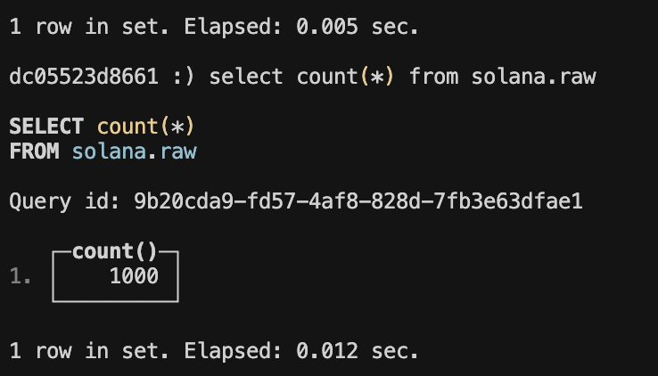
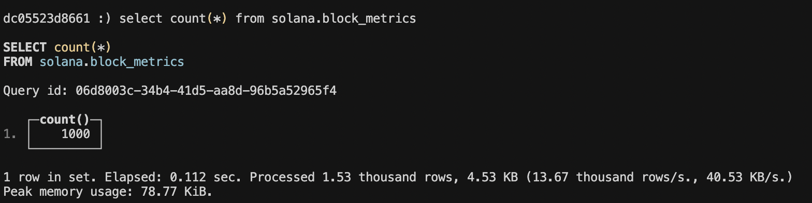

# Solana Blocks Analysis

## Main Files
[rpc.py](https://github.com/waddahAldrobi2/solana_transactions/blob/main/rpc.py#L19) : Fetches Solana raw RPC data and writes them to `solana.raw` table

[metrics.py](https://github.com/waddahAldrobi2/solana_transactions/blob/main/metrics.py#L5) : Fetches `solana.raw` data and computes vote and non-vote transaction counts, total fees, and total compute at each block

## Project overview and approach

This project provides a framework to store and analyze Solana blockchain data. It focuses on analyzing block metrics such as transaction counts, total fees, and total compute.

ClickHouse is used as the OLAP system to store and analyze the data on

See `/notebooks` for some examples of analysis of the data. 
The analysis was done on from block `339983000` for a `1000` blocks, using the [Helius](https://www.helius.dev/solana-rpc-nodes) RPC node.

To categorize a vote transactions, the Solana [is_simple_vote](https://docs.rs/solana-program/2.1.13/src/solana_program/vote/instruction.rs.html#168-180) was used as a reference.

## Prerequisites

- Python 3.x
- Docker
- ClickHouse (via Docker)
- Solana RPC endpoint

## Setup

1. Clone the repository
2. Set up and activate a virtual environment:
```bash
# Create virtual environment
python -m venv venv

# On macOS/Linux:
source venv/bin/activate
# On Windows:
.\venv\Scripts\activate
```

3. Create a `.env` file and fill in the necessary configurations. See `.env_example` as an example

4. Install Python dependencies:
```bash
pip install -r requirements.txt
```

5. Start ClickHouse and create tables:
```bash
docker-compose up
```

This will create two tables in ClickHouse: 
- `solana.raw`: Raw block data
- `solana.block_metrics`: Processed block metrics

6. To query the ClickHouse database:
```bash
docker exec -it clickhouse-server clickhouse-client
```

7. Turn off ClickHouse with: 
```bash
docker-compose down
```

## Testing

Run: `pytest tests.py`

## Usage Examples

1. Fetch and store block data in `solana.raw`:
```bash
python rpc.py
```

2. Example ClickHouse queries:
```sql
-- Get total transactions per block
SELECT COUNT(*) FROM solana.raw
```

For example, I ingested a 1000 blocks:




## Running Block Metrics

Assuming ClickHouse server is running with `docker-compose`, you can follow these steps: 

1. Ingest raw daw into `solana.raw` by running: 

`python rpc.py`

2. Compute the block metrics into `solana.block_metrics` by running:

`python metrics.py`

3. Use ClickHouse client to query the data as shown in usage examples


If done correctly, you should see in `solana.block_metrics`, as shown below:

